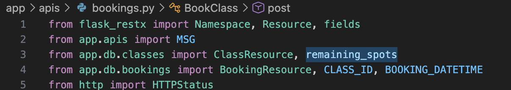
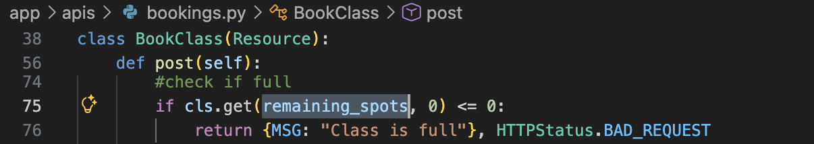
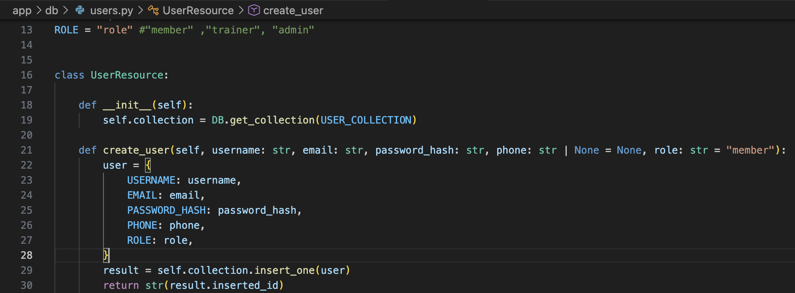
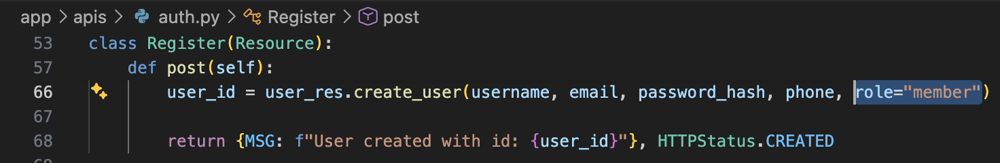

# Design Reflection

## 1. Executive Summary

### 1.1 Approach

- **Goal:** Critically analyze the current system design to prepare for Feature 6 (recurring classes) and Feature 7 (configurable notifications).

- **Tools used:**
  - UML support (sequence-diagram generator) to create initial Book Class endpoint sequence diagram.
  - Manual inspection of modules and tests to validate and refine diagrams and findings.

- **Manual analysis:**
  - Traced end-to-end flows for:
    - Authentication and authorization.
    - API layer
    - DB layer
  - Reviewed code for:
    - Violations of OOD and SOLID principles.
    - Code smells

- **Team member responsibilities:**
  - Isumi: Sequence diagram fo Book Class endpoint, identify design principle violations and code smells for Book Class flow and authentication flow
  - Nadja:
  - Rujul:

---

## 2. Design Diagrams (Task 1)

### 2.1. Class Diagram – Current Design

### 2.2. Sequence Diagram – Book a Class Endpoint

### 2.3. Sequence Diagram – Reminder/Notification Endpoint

---

## 3. Design Principles Reflection (Task 2)

### 3.1. Encapsulation (OOD Principle)

#### 3.1.1. Example 1
- **Location:** `app/db/classes.py` and `app/apis/bookings.py` – `method name` - imported from `classes.py` at `line 3` in `bookings.py`, used in `line 75`

 

 

- **Description:**
  - The API layer directly imports and uses the DB field name `remaining_spots` to check whether a class is full.
- **Why it’s a violation:**
  - This breaks encapsulation because the API layer knows the internal field name used by the DB layer. The logic for deciding whether a class is full should be hidden behind a method in `ClassResource`, instead of exposing raw schema details. In the current design, if the DB field name changes, the API code also has to change.
- **Possible refactor:** 
  - Add a method such as `is_class_full(class_id)` in `ClassResource` and let the API call that instead of checking remaining_spots directly.

#### 3.1.2. Example 2
- **Location:** `app/db/users.py` - `create_user()` - `line 13`, `line 27`

   

- **Description:**
  - User roles are represented as raw strings, and authorization logic is based on string comparisons scattered across the codebase.
- **Why it’s a violation:**
  - This breaks encapsulation because there is no central authorization helper or module that defines what roles exist and what permissions each role has. The meaning of roles is spread across the system instead of being controlled in one place. So adding a new role or changing permissions would require searching through multiple files and updating string-based checks manually.
- **Possible refactor:** 
  - Introduce a centralized authorization helper, role enum, or permission-checking method so role definitions and access rules are managed in one place.

### 3.2. Modularity (OOD Principle)

### 3.3. Single Responsibility Principle

### 3.4. Open-Close Principle

#### 3.4.1. Example 1

- **Location:** `app/db/users.py` - `create_user()` - `line 21`\
& `app/apis/auth.py` - `Register.post()` calling `create_user()` - `line 66`

   

 

- **Description:**
  - User creation is implemented so that new users are always created as `"member"` from the registration flow, and the registration logic is not structured to support other role-specific registration paths.
- **Why it’s a violation:**
  - This violates the Open–Closed Principle because adding a new registration path (for example, a trainer-specific registration that assigns `"trainer"`) would require modifying the existing `Register.post()` logic or `create_user` behavior instead of simply adding a new extension (a different registration endpoint or strategy). The current design is not “closed to modification” when new roles or registration flows are needed.
- **Possible refactor:** 
  - Introduce role-aware registration strategies or separate registration endpoints (e.g., `MemberRegister`, `TrainerRegister`) that point to a common user-creation service, allowing new flows to be added without changing the existing ones.

### 3.5. Dependency Inversion Principle

---

## 4. Code Smells (Task 3)

### 4.1. Long Method

#### 4.1.1. `BookClass.post(...)`
- **Location:** `file path` – `method name` - `line number`
- insert code screenshot
- **Why:**
  - ...
- **Refactoring suggestion:** (optional)
  - Use **Extract Method** to ....

### 4.2. Primitive Obsession

### 4.3. Long Parameter List

### 4.4. Duplicate Code

### 4.5. Dead Code

---

## 5. Reflection on New Features (Task 4)

### 5.1. Overall Maintainability and Extensibility

#### for Feature 6 Recurring Classes: 
#### for Feature 7 Configurable Notifications:

### 5.2. Existing Design Flaws

#### impacting Feature 6 Recurring Classes: 
#### impacting Feature 7 Configurable Notifications:  