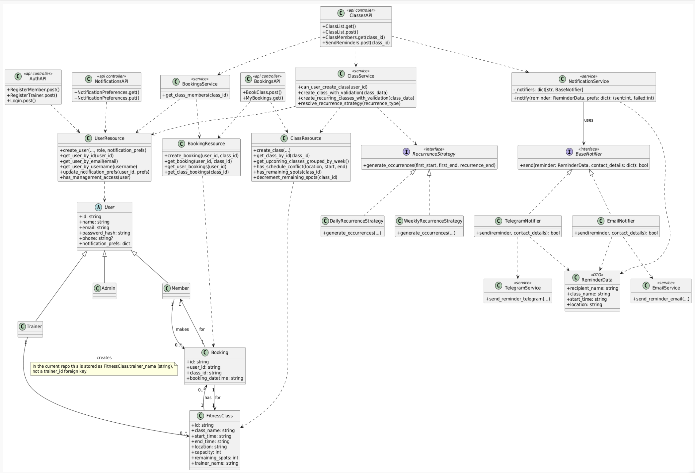

# Redesign Report

## Feature 6 : Create recurrence classes

**Design Pattern**: 

*Strategy* - Defines a set of algorithms, puts each into a separate class, and makes their objects interchangeable. The user is able to replace one object by another during runtime.

**Why**: 

Feature 6 is best suited to the Strategy pattern because recurring-class creation requires selecting one of several scheduling algorithms at runtime, such as daily or weekly generation.

The system was refactored so that the API doesn't contain recurrence-specific branching logic. The service layer delegates occurrence generation to a RecurrenceStrategy implementation, while existing validation and persistence stay in the current service and ClassResource classes.

This improves adherence to the Open–Closed Principle because adding a new recurrence type, such as biweekly, only requires adding another strategy class rather than modifying the existing class-creation flow.

**Refactoring**:

- Introduced a RecurrenceStrategy hierarchy under app/services/recurrence.py.
- Refactored scheduling logic out of the API layer into services/classes.py (create_recurring_classes_with_validation), reusing existing validation functions.
- Modified ClassList.post in apis/classes.py to be closed for changes: single-class creation remains unchanged, recurring logic is handled by strategies and a thin service layer.

**Why it fixes previous smells**:

- Avoids bloating post() with multiple recurrence branches (solves Long Method).
- Makes recurrence extension a matter of adding a new strategy (satisfies Open–Closed).
- Keeps scheduling logic centralized and reusable across single and recurring flows.

## Feature 7: Configure Notifications

**Design Pattern**:

*Strategy* - Defines a family of algorithms, encapsulates each one, and makes them interchangeable. Each notification channel is a separate strategy that can be selected at runtime based on the user's preferences.

**Why**:

Feature 7 is best suited to the Strategy pattern because notification delivery requires selecting one or more channels at runtime (email, Telegram, and future channels like SMS or Discord). The system needed to be open for extension but closed for modification such that adding a new channel should not require touching existing code.

**Refactoring**:

- Introduced a `BaseNotifier` abstract class in `app/services/notifications.py` defining the `send(reminder, contact_details)` interface.
- Implemented `EmailNotifier` and `TelegramNotifier` as concrete strategies.
- Introduced `NotificationService` as the context class that holds a registry of notifiers and dispatches to whichever channels are listed in the user's `notification_prefs`.
- Introduced `ReminderData` as a parameter object to replace the long argument list previously passed to `send_reminder_email`.
- Added `NOTIFICATION_PREFS` field to the user profile in `db/users.py` storing a dict mapping channel name to contact detail (e.g. `{"email": "user@example.com", "telegram": "123456789"}`).
- Added `app/apis/notifications.py` with `GET` and `PUT /notifications/preferences` endpoints allowing users to view and update their notification preferences.

**Why it fixes previous violations**:

- **OCP**: `SendReminders.post()` no longer needs to be modified when a new channel is added. Adding SMS only requires a new `SmsNotifier` class and one line in `NotificationService.__init__()`.
- **DIP**: `SendReminders.post()` now depends on the `BaseNotifier` abstraction through `NotificationService`, not on the concrete `send_reminder_email` function directly.
- **Long Parameter List**: `ReminderData` dataclass groups the five reminder primitives into one object passed to each notifier.

## Design Violation & Code Smell Fixes

### (3.1.1) Encapsulation of remaining_spots:
Fixed the encapsulation violation around class capacity by removing direct access to the remaining_spots field from `apis/bookings.py`. Instead of reading the raw database field name in the API layer, the booking flow now calls `ClassResource.has_remaining_spots(class_id)`.

### (3.1.2, 4.2.1) Role strings and primitive obsession, encapsulation of authorization logic:
Fixed the primitive obsession and role-encapsulation issue by replacing scattered string literals such as `"member"` and `"trainer"` with a dedicated Role enum in `db/users.py`. The API layer now calls `create_user(..., role=Role.MEMBER)` and `create_user(..., role=Role.TRAINER)`, so valid roles are centralized and type-like rather than being treated as arbitrary text. Also added helper methods such as `is_admin`, `is_trainer`, and `user_has_management_access` to move permission-related behavior into `UserResource`, which improves encapsulation and removes duplicated authorization logic.

### (3.1.3) Encapsulation of class field constants:
Previously, `app/apis/classes.py` imported class field constants directly from `app/db/classes.py`, creating a dependency on DB-layer implementation details. This issue was resolved by moving shared constants such as `class_name`, `start_time`, `end_time`, `location`, `capacity`, `trainer_name`, `remaining_spots`, `CLASS_COLLECTION` and `CLASS_WINDOW_DAYS` into `app/db/constants.py`. Both the API and DB layers now import from this shared module, removing direct coupling between layers.

### (3.1.4) Encapsulation of class overlap logic:
The API layer previously accessed and iterated over the internal structure returned by `ClassResource.get_upcoming_classes_grouped_by_week()`, exposing knowledge of data representation. This logic has been encapsulated within `ClassResource.has_schedule_conflict(...)`, so the API/service layer now interacts through a method instead of handling raw data structures directly.

### (3.2.1) High Coupling in `ClassList.post()`:
Previously, the API endpoint directly handled authorization, validation, datetime parsing, scheduling constraints and database interactions, while also constructing and depending on concrete classes such as `UserResource` and `ClassResource`. This resulted in high coupling between the API layer and multiple internal components.

This has been addressed by introducing a service layer (`app/services/classes.py`) where business logic is encapsulated into dedicated functions such as `user_has_management_access(...)`or `create_class_with_validation(...)` . 

As a result, coupling has been reduced because the API no longer depends on the internal structure or behavior of multiple components, but instead interacts with a higher-level abstraction through service functions. This improves modularity and makes the system easier to maintain and extend.

### (3.3.1) Single Responsibility Principle for `ClassMembers.get()` and `SendReminders.post()`:
Both methods previously handled authorization, class lookup, booking retrieval, member fetching, and notification sending all in one place. Fixed by using shared helpers.

### (3.3.2) Single Responsibility Principle in `ClassList.post()`:
Previously, the `ClassList.post()` method handled multiple responsibilities including request validation, authorization, input validation, datetime parsing, scheduling constraints, overlap checking, class creation and response formatting. This violated the Single Responsibility Principle because the method had multiple independent reasons to change.

This has been resolved by extracting responsibilities into smaller helper functions and a dedicated service layer (`app/services/classes.py`). The API layer now uses helper methods such as `validate_json_body(...)`, `validate_management_access(...)`, `extract_class_data(...)` and `validate_class_data(...)`.

As a result, the API method is now primarily responsible for handling HTTP requests and implementing logic, while validation, scheduling, and creation concerns are handled separately. This ensures each component has a single responsibility and improves maintainability and clarity of the code.

### (3.4.1) Open-Closed Principle for registration:
Fixed the Open-Closed Principle violation in registration by separating registration into `RegisterMember` and `RegisterTrainer` endpoints. Previously, registration logic was tied to one flow that always created a member, so supporting trainer registration required modifying existing behavior. In the refactored design, new registration behavior is added through separate endpoint classes while `UserResource.create_user()` accepts a role parameter, making the registration flow easier to extend without rewriting the original member-registration logic.

### (3.4.2, 3.5.1) Open-Closed Principle & Dependency Inversion in `SendReminders.post()`:
Previously `SendReminders.post()` called `send_reminder_email` directly, making it impossible to add new notification channels without modifying the method. Fixed by introducing `NotificationService` with the Strategy pattern. 

### (3.4.3) Open–Closed Principle in authorization logic:
Previously, authorization logic in `ClassList.post()` relied on hardcoded string literals such as "trainer" and "admin" to determine access. This violated the Open–Closed Principle because adding a new role or modifying permissions required directly changing the existing conditional logic.

This has been addressed by extracting authorization logic into a helper function `validate_management_access(...)`, which relies on the service-layer function `user_has_management_access(...)`. Role-checking behavior is now encapsulated within the user resource layer rather than being hardcoded in the API.

As a result, the system is now open for extension, since new roles or permission rules can be introduced by modifying the centralized authorization logic without requiring changes to the API endpoint.

### (4.1.1) Long Method BookClass.post:
Reviewed the long-method concern in `BookClass.post()`, but after refactoring the capacity access and keeping the method in a flat early-return style, the controller remained readable enough for its current responsibilities, so no additional decomposition was introduced beyond the encapsulation fix.

### (4.1.2) Long Method in `ClassList.post()`:
Previously, the `ClassList.post()` method was long and handled multiple responsibilities, including request validation, authorization, input validation, datetime parsing, scheduling constraints, overlap checking and class creation. This resulted in a method that was difficult to read, maintain, and test.

This has been addressed by extracting logic into smaller helper functions such as `validate_json_body(...)`, `validate_management_access(...)`, `extract_class_data(...)` and `validate_class_data(...)` and by moving business logic into the service layer.

As a result, the `post()` method is now shorter and primarily responsible for coordinating the request flow, while detailed logic is handled in separate functions. This improves readability and maintainability of the code.

### (4.1.3) Long Method in `get_upcoming_classes_grouped_by_week()`:
Previously, `get_upcoming_classes_grouped_by_week()` handled several responsibilities in one method, including retrieving classes, parsing start times, filtering classes within the upcoming window, generating week keys and grouping classes by week.

This has been addressed by extracting smaller helper methods inside `ClassResource`, including `parse_class_start_time(...)`, `is_class_within_upcoming_window(...)` and `get_week_key(...)`. These helpers separate date parsing, filtering and week-key generation from the main grouping method.

As a result, `get_upcoming_classes_grouped_by_week()` is shorter, easier to read and more focused on grouping upcoming classes rather than handling every step internally.

### (4.3.1) Long Parameter List in `send_reminder_email()`:
Fixed by introducing the `ReminderData` dataclass as a parameter object. Instead of passing five separate primitives, a single `ReminderData` instance is constructed in `SendReminders.post()` and passed to the notifier.

### (4.4.1) Duplicate Code in `ClassMembers.get()` and `SendReminders.post()`:
Both methods previously duplicated identical authorization and class-lookup blocks. Fixed by extracting shared helpers used by both methods.

### (4.4.2) Duplicate Code in validation logic:
Previously, validation logic for required fields was duplicated across multiple conditional statements, with similar checks repeated for each field. This resulted in unnecessary repetition and reduced maintainability.

This has been addressed by introducing reusable helper functions such as `validate_required_string(...)` and `validate_positive_int(...)`. The `validate_class_data(...)` function now iterates over a list of required fields and applies these helpers instead of repeating validation logic for each field.

As a result, duplication has been removed and validation logic is more concise, consistent, and easier to maintain.

### (4.5.1) Dead code in users.py, auth.py:
Removed dead code in `db/users.py` by deleting the unused serialize_items import. 

Removed the dead-code issue in `apis/auth.py` by replacing the unused old role import pattern with the actively used Role enum.

### Duplicate Code in tests (additional change):
Previously, test files (`test_classes.py`, `test_reccurance.py`) contained duplicated setup logic, including application initialization, authentication helpers and class payload creation. This resulted in unnecessary repetition and reduced maintainability of the test suite.

This has been addressed by refactoring the test structure and extracting shared logic into reusable components. A `conftest.py` file was introduced to manage shared pytest fixtures such as `app_client`. Additionally, a `test_helpers.py` module was created to contain reusable helper functions, including `build_valid_class(...)`, `create_class(...)`, `get_admin_auth_header(...)` and `get_member_auth_header(...)`.

As a result, duplicated setup logic has been removed from individual test files, and responsibilities are now clearly separated. 

### Long Method `SendReminders.post()`:
Fixed by extracting `get_class_members(class_id)` in `services/bookings.py` which moved the member-loop logic out of the method.

## Class Diagram

The Sprint 3B class diagram introduces an explicit domain model (User with Member/Trainer/Admin subclasses, FitnessClass, Booking) and uses associations only between these entities (based on Sprint 3a feedback). It also adds two Strategy‑based subsystems: RecurrenceStrategy for recurring classes and BaseNotifier/NotificationService for multi‑channel notifications based on per‑user notification_prefs, while api controllers now show the dependence on service layer.

>> ## Team member responsibilities:
>>  - Isumi: Refactors for Design Principle Violations 3.1.1, 3.1.2, 3.4.1 & Code Smells 4.1.1, 4.2.1, 4.5.1, Feature 6 Create recurring classes implementation, Class diagram creation
>>  - Nada: Refactors for Design Principle violations 3.1.3, 3.1.4, 3.2.1, 3.3.2, 3.4.3  & Code Smells 4.1.2, 4.1.3 and 4.4.2., Tests for Feature 6 Create recurring classes implementation and CI.
>>  - Rujul: Refactors for Design Principle Violations 3.3.1, 3.4.2, 3.5.1 & Code Smells 4.4.1, 4.3.1, Feature 7 Configure notifications implementation, Tests for Feature 7