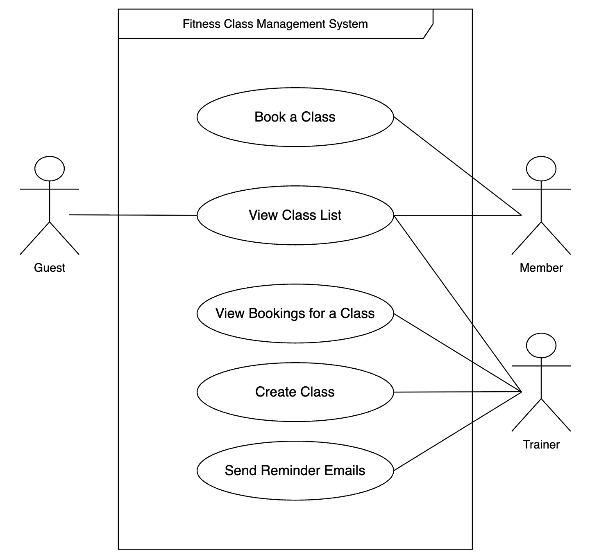

# 1. Requirements Elicitation and Analysis

## Client Meeting Information
- **Date of Meeting:** February 11, 2026 
- **Duration:** 30 minutes

## Elicitation Techniques Used

1. **Structured Interviewing**
   - We prepared an extensive list of functional and non-functional questions.
   - We asked about expected system behavior, edge cases, constraints, and priorities.

2. **Scenario-Based Discussion**
   - We presented hypothetical user scenarios.
   - We asked how the system should respond in different situations.

3. **Use Case Discussion**
   - We discussed the four major system features.
   - We clarified actors and system boundaries.

## Reflection

### (1) Usefulness of Techniques

The structured form of interviewing with pre defined questions was very useful because it ensured we covered all major system aspects and avoided missing key requirements. It also helped uncover edge cases and clarify ambiguous behaviors.

In retrospect, we would improve our process by:
- Bringing wireframes to better visualize system interactions.

### (2) Important Clarification Gained

During the elicitation process, we clarified the distinction between registered members and unregistered guests. The client specified that only registered members should be allowed to book classes, while unregistered users may only view available classes.

This clarification directly impacted our backend design by requiring authentication mechanisms and role-based access to enforce these restrictions. Additionally, the client discussed potential future enhancements involving expanded administrative roles and functionality, which encouraged us to design the system with scalability in mind.

---

# 2. Requirements Specification

## UML Use Case Diagram

### Use Case Specifications

### Feature 1: Create Class
**Use Case:** Create Class  

**Primary Actor:** Trainer, Admin  

**Preconditions:** 
-   User is registered and authenticated as trainer/admin.

**Main Success Scenario:**
1. Trainer/Admin logs into the system.  
2. Trainer/Admin proceeds to the Create Class page.  
3. System displays a form requesting class details (class name, start time, end time, location, capacity, trainer’s name).  
4. Trainer/Admin enters the class details.  
5. System validates important information:  
   - Start time is before end time.  
   - Class date falls within the upcoming two weeks.  
   - Capacity is a positive number.  
6. Trainer/Admin submits the form.  
7. System creates the class and stores it.  
8. System confirms successful creation of the class.   

**Extensions:**
- 5a. If the class is scheduled outside the upcoming two weeks, the system returns an error indicating “Classes can only be created for the upcoming two weeks.”  
- 5b. If the end time is earlier than or equal to the start time, the system returns an error indicating “End time must be after start time.”  
- 6a. If one or more required fields (start time, end time, location, capacity, trainer’s name) are missing, the system returns a validation error and states the missing fields.  
- 6b. If the capacity is zero, negative or not a number, the system returns an error indicating “Capacity must be a positive number.”  
- 7a. If a system or database error occurs, the system returns an error indicating that the class could not be created.  

**Success guarantee:**
- A new class exists in the system with the provided details.

### Feature 2: View Class List

**Use Case:** View Class List  

**Primary Actor:** Guest/Member, Trainer, Admin  

**Preconditions:** 
- No additional preconditions. 

**Main Success Scenario:**
1. Actor opens the Class List page.  
2. System retrieves all classes scheduled within the upcoming two weeks.  
3. System displays the list of upcoming classes to the actor by week.  
4. For each class, the system displays the following details: class_name, start time, end time, location, trainer name, capacity and remaining spots.  
5. In case the class is full, it will still be displayed as part of View Class List function and the capacity will be assigned value of 0.
6. Actor views the class list.  

**Extensions:**
- 2a. If there are no upcoming classes within the next two weeks, the system displays a message indicating “No upcoming classes available.”  
- 3a. If a system or database error occurs while retrieving classes, the system returns an error indicating that the class list could not be loaded.  

**Success guarantee:**
- The system returns the list of upcoming classes scheduled within the next two weeks, including classes that are fully booked with remaining spots shown as 0.

### Feature 3: Book a Class

**Use Case:** Book a Class  

**Primary Actor:** Member (authenticated user)  

**Preconditions:** 
- User is registered and authenticated as a member (valid JWT).
- The class to be booked exists in the system.  

**Main Success Scenario:**
1. Member views the list of upcoming classes and chooses a specific class to book.
2. Member submits a booking request for that class.
3. System verifies that the class exists.
4. System verifies that the member has not already booked this class.
5. System verifies that the class is not full (there is at least one remaining spot).
6. System decrements the class’s remaining spots and creates a booking record linking the member to the class.
7. System returns a confirmation message and stores the booking so it appears in the member’s “My Classes” view.

**Extensions:**
- 3a. If the class does not exist, the system returns an error indicating “Class not found.”
- 4a. If the member has already booked this class, the system returns an error indicating the class is already booked by this user.
- 5a. If the class is full (no remaining spots), the system returns an error indicating the class is full and does not create a booking.
- 2a. If the booking request is missing or has an invalid class identifier, the system returns a validation error.

**Success guarantee:**
- A new booking exists linking the member to the selected class, and the class’s remaining spots have been reduced by one. The booking appears in the member’s “My Classes” list.

### Feature 4: View Bookings for a Class

**Use Case:**  View Bookings for a Class 
**Primary Actor:** Trainer  
**Preconditions:** User is authenticated as trainer 

**Main Success Scenario:**
1. Trainer selects a class to view bookings
2. System checks that the selected class exists
3. System retrieves all bookings for selected class
4. System displays the details of members who have booked the class

**Extensions:**
- 2a. If the class selected does not exist, system displays an error message
- 3a. In case of no bookings yet, system displays a placeholder message

**Success guarantee:**
- The system returns the booking list for the selected class

### Feature 5: Send Reminder Emails
**Use Case:** Send Reminder Emails  

**Primary Actor:** Trainer, Admin  

**Preconditions:** 
- User is registered and authenticated as trainer/admin.
- The selected class exists in the system.

**Main Success Scenario:**
1. Trainer/Admin logs into the system.  
2. Trainer/Admin selects a class and proceeds to send reminder emails.  
3. System verifies that the user is authorized as trainer/admin.  
4. System retrieves the class information from the database.  
5. System retrieves all members registered for the selected class.  
6. System prepares reminder emails containing the class name, start time, and location.  
7. System sends reminder emails to all valid registered members with email addresses.  
8. System keeps track of successful and failed email deliveries.  
9. System confirms how many reminder emails were successfully sent and how many failed.  

**Extensions:**
- 3a. If the user is not a trainer/admin, the system returns an error indicating “Only trainers or admins can send reminders.”  
- 4a. If the selected class does not exist, the system returns an error indicating “Class not found.”  
- 5a. If no members are registered for the class, the system returns a message indicating “No members are registered for this class.”  
- 7a. If a booked member record is invalid or the member no longer exists in the system, the system skips that member and counts the reminder as failed.  
- 7b. If a booked member does not have an email address, the system skips that member and counts the reminder as failed.  
- 7c. If an email delivery fails, the system counts that reminder as failed and continues sending reminders to the remaining members.  

**Success guarantee:**
- Reminder emails are sent to registered members with valid email addresses.
- The system returns a summary indicating the number of successful and failed reminder emails.

---

